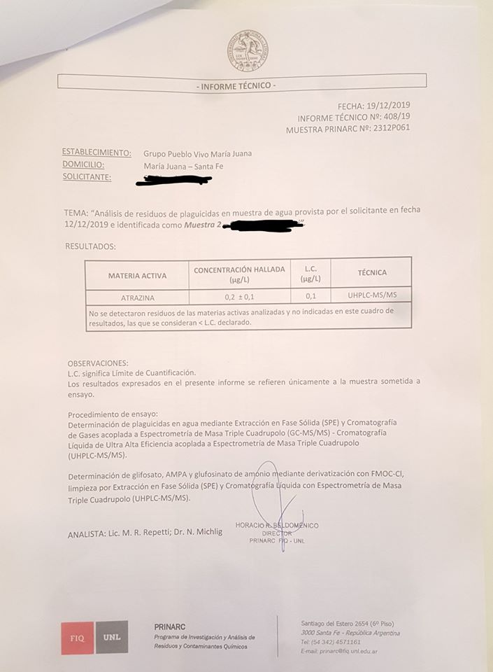

### 1) Atrazina en Agua de la Canilla
María Juana, Santa Fé: A través de la Agrupación <a href="https://www.facebook.com/Pueblo-Vivo-Mar%C3%ADa-Juana-105321714169305/"> Pueblo Vivo </a> se detectó Atrazina en una muestra de Agua. Ahora buscan apoyo económico para comprar los reactivos que se necesitan para hacer estudios de plaguicidas en suelo, agua y aire.
"__BUSCAMOS APOYO ECONÓMICO PARA LOS ESTUDIOS DEL CONICET__

_Como es de público conocimiento, en el mes de marzo vendrán científicos del CONICET y de la Universidad Nacional de La Plata para realizar estudios de aire, agua y suelo de la localidad de María Juana, para detectar si estamos expuestos o no, como habitantes de esta localidad, a sustancias que nos afectan la salud como los agroquímicos._"

imágen del resultado del análisis de la muestra de agua

### 2) Glifosato y AMPA en agua de lluvia
Un estudio Realizado por el equipo del Dr. Marino de la UNLP encontró distintas concentraciones de Glifosato y su metabolito (AMPA) en distintas provincias de la región Pampeana
- Santa Fé: compuesto por Brinkmann, Córdoba y Hersilia, Santa Fé: (resultados santa fe)
- Entre Rios: Urdinarrain 
- Buenos Aires: compuesto por La Plata y Coronel Suarez
- Córdoba: compuesto por Malvinas Argentinas, Barrio Ituzaingó Anexo y Marcos Juarez

latitud|longitud|lugar|fecha|dirección|cant|especies colocadas|imagenes|
-------|---------|----|-----|---------|----|------------------|--------|
-33.097377|-64.300214|Predio Pablo Aimar A.A.E|Septiembre 2019|Iguazú|27|-Arca (Parasenegallia visco) -Aguaribay (Schinus areira)|respeto.org.ar/tequieroverde/img/AAE.jpg
